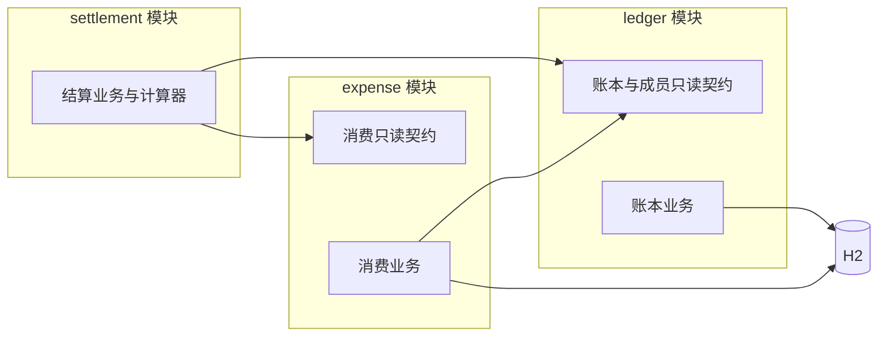
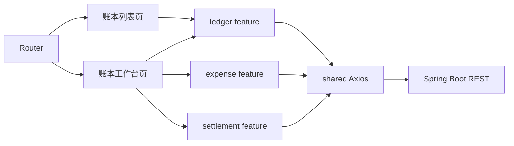

# 项目架构设计

## 1. 设计依据

本项目采用前后端分离的小型单体架构。产品范围与业务规则以 `docs/01-requirements-specification.md` 为准，已经验证的技术与运行环境以 `docs/05-engineering-guide.md` 为准；本文只定义目录、模块职责、依赖方向和数据归属。

## 2. 仓库边界

```text
split-bills/
├── docs/
├── backend/
│   ├── pom.xml
│   └── src/
│       ├── main/
│       │   ├── java/com/split/
│       │   └── resources/
│       └── test/java/com/split/
├── frontend/
│   ├── package.json
│   └── src/
└── .gitignore
```

| 边界 | 职责 |
| --- | --- |
| `frontend/` | 浏览器界面、页面状态、用户交互和后端请求 |
| `backend/` | 业务校验、事务、结算计算和数据持久化 |
| `docs/` | 已确认且长期有效的需求、架构、数据、接口和工程事实 |

前端与后端作为两个独立应用运行。两者只通过后续确认的 REST JSON 契约通信，不共享源码模型或构建产物。

## 3. 后端结构

后端基础包为 `com.split`，采用“按业务模块分包、模块内部再分层”的结构：

```text
com.split/
├── SplitBillsApplication.java
├── ledger/
├── expense/
├── settlement/
└── common/
    ├── web/
    └── exception/
```

### 3.1 模块职责与数据归属

| 模块 | 业务职责 | 数据归属 | 对外提供 |
| --- | --- | --- | --- |
| `ledger` | 管理账本及其成员，校验账本和成员的有效性 | 账本、成员 | 账本和成员的只读查询契约 |
| `expense` | 管理消费、付款人和参与关系，执行消费录入校验 | 消费及其参与关系 | 结算所需的消费只读快照 |
| `settlement` | 汇总实付与承担金额，计算净余额和转账建议 | 不持久化业务数据 | 结算结果 |
| `common` | 全局异常、统一响应及无业务含义的基础支持 | 无 | 通用基础能力 |

成员只能存在于某个账本中，因此属于 `ledger`，不单独建立成员模块。结算结果始终从当前成员和消费数据推导，不建立结算实体或结算仓储。

### 3.2 模块内部约定

- 业务入口遵循 Controller → Service → Mapper 的调用方向。
- `ledger` 与 `expense` 按需设置 Controller、Service、Mapper、实体、DTO 和 `contract`；不存在实际职责时不创建空目录。
- `settlement` 设置 Controller、Service、DTO 和独立计算器，不设置 Mapper 或持久化实体。
- 跨模块只传递 `contract` 中定义的稳定只读对象，不传递内部实体。
- 常规数据访问优先使用 MyBatis-Plus Mapper，不为首版预建 XML Mapper。
- `common` 不得承载账本、消费或结算规则，也不得成为任意代码的默认存放位置。
- 统一响应和分页均位于 `common.web`，所有业务异常按 HTTP 状态码语义（如 `NotFoundException`、`BadRequestException`）集成于 `common.exception`。

### 3.3 依赖方向



依赖必须保持单向：`expense → ledger`，`settlement → ledger + expense`。`ledger` 不反向调用 `expense`，模块间不得形成循环依赖。数据库约束负责数据引用完整性的最终兜底，业务层负责把相关失败转换为可理解的业务错误；具体约束留到数据库设计阶段确认。

## 4. 前端结构

前端采用“应用装配 + 页面容器 + 业务功能 + 共享基础”的结构：

```text
src/
├── app/
├── views/
├── features/
│   ├── ledger/
│   ├── expense/
│   └── settlement/
└── shared/
```

### 4.1 目录职责

| 目录 | 职责 |
| --- | --- |
| `app/` | 应用启动、Router、Pinia 和界面主题装配 |
| `views/` | 路由页面及跨功能操作协调，不承载底层请求细节 |
| `features/ledger/` | 账本与成员的 API、Pinia 状态、类型和业务组件 |
| `features/expense/` | 消费的 API、Pinia 状态、类型和业务组件 |
| `features/settlement/` | 结算的 API、Pinia 状态、类型和展示组件 |
| `shared/api/` | 唯一的 Axios 客户端及通用请求处理 |
| `shared/components/`、`shared/styles/` | 经实际复用确认的通用界面与样式 |

每个 feature 只在实际需要时创建 `api`、`stores`、`types` 或 `components`，不预建空目录。表单草稿保留在页面或组件内部，Pinia 只保存跨页面共享的数据和请求状态。

### 4.2 页面与依赖方向

| 路由 | 页面职责 |
| --- | --- |
| `/` | 展示和管理账本列表 |
| `/ledgers/:ledgerId` | 作为账本工作台，组合成员、消费和结算功能 |



工作台页面是跨功能协调者：消费变更成功后，由页面触发消费与结算刷新。三个 feature 不直接相互导入，`shared` 也不得反向依赖任何 feature，从而避免状态和模块循环依赖。

## 5. 结构约束

- 不建立全局 `services/`、`models/` 或 `utils/` 杂物目录；共享内容必须先证明存在跨功能复用价值。
- 不保留脚手架演示页面、演示组件或静态业务数据。
- H2 数据文件位于后端本地运行数据目录，并由根 `.gitignore` 排除；运行数据不属于源码。
- 后端测试目录镜像业务模块，首版自动化测试重点放在 `settlement` 的核心算法。
- 接口路径、DTO 字段、数据库表和约束细节分别在后续 API 与数据库设计中确认，不在本文提前定义。
