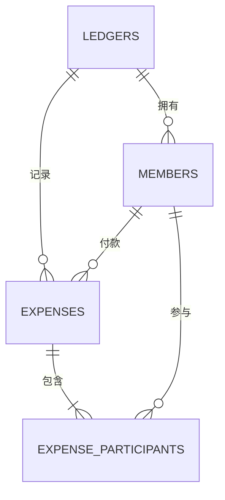

# 数据库设计

## 1. 设计依据与状态

产品规则以 `docs/01-requirements-specification.md` 为准，模块的数据归属以 `docs/02-architecture-design.md` 为准。本文是后续编写 `schema.sql` 和数据访问代码的唯一数据库设计来源，不定义 REST 接口。

| 逻辑资源 | 所有者 | 设计状态 | 实现状态 |
| --- | --- | --- | --- |
| `ledgers` | `ledger` 模块 | 已确认 | 已创建 |
| `members` | `ledger` 模块 | 已确认 | 已创建 |
| `expenses` | `expense` 模块 | 已确认 | 已创建 |
| `expense_participants` | `expense` 模块 | 已确认 | 已创建 |

用户已确认后端构建和启动成功，`schema.sql` 已由 Spring Boot 执行，四张表完成创建。初始化脚本不包含示例数据，当前也没有业务接口写入数据。

## 2. 数据关系

- 一个账本可以暂时没有成员或消费。
- 一笔消费必须有一名付款成员和至少一名参与成员。
- 付款成员可以不在该笔消费的参与成员中。
- `expense_participants` 只表示参与关系，不保存个人分摊金额。
- 结算结果由当前成员、消费和参与关系实时推导，不建立结算表。

## 3. 表设计

### 3.1 `ledgers`

| 字段 | 数据库类型 | Java 类型 | 可空 | 说明 |
| --- | --- | --- | --- | --- |
| `id` | `BIGINT` 自增 | `Long` | 否 | 主键 |
| `name` | `VARCHAR(100)` | `String` | 否 | 去除首尾空格后的账本名称 |
| `created_at` | `TIMESTAMP` | `LocalDateTime` | 否 | 创建时间，插入时由数据库提供默认值 |
| `updated_at` | `TIMESTAMP` | `LocalDateTime` | 否 | 初始值由数据库提供，修改时由 Service 更新 |

约束：

- 主键：`id`。
- `name` 必须等于自身的去首尾空格结果，且去空格后长度大于 0。
- 不设置账本名称唯一约束，不同账本可以同名。

### 3.2 `members`

| 字段 | 数据库类型 | Java 类型 | 可空 | 说明 |
| --- | --- | --- | --- | --- |
| `id` | `BIGINT` 自增 | `Long` | 否 | 主键，同时作为稳定的成员创建顺序 |
| `ledger_id` | `BIGINT` | `Long` | 否 | 所属账本 |
| `name` | `VARCHAR(50)` | `String` | 否 | 去除首尾空格后的成员姓名 |
| `created_at` | `TIMESTAMP` | `LocalDateTime` | 否 | 创建时间 |
| `updated_at` | `TIMESTAMP` | `LocalDateTime` | 否 | 最后修改时间 |

约束：

- 主键：`id`。
- 外键：`ledger_id` 引用 `ledgers.id`，删除账本时级联删除成员。
- 唯一键：`(ledger_id, name)`，按大小写敏感规则防止同一账本内重名。
- 唯一键：`(ledger_id, id)`，作为同账本组合外键的引用目标。
- `name` 必须等于自身的去首尾空格结果，且去空格后长度大于 0。

### 3.3 `expenses`

| 字段 | 数据库类型 | Java 类型 | 可空 | 说明 |
| --- | --- | --- | --- | --- |
| `id` | `BIGINT` 自增 | `Long` | 否 | 主键 |
| `ledger_id` | `BIGINT` | `Long` | 否 | 所属账本 |
| `title` | `VARCHAR(200)` | `String` | 否 | 去除首尾空格后的消费名称 |
| `amount_cents` | `BIGINT` | `Long` | 否 | 人民币金额，单位为分 |
| `expense_date` | `DATE` | `LocalDate` | 否 | 业务发生日期 |
| `payer_member_id` | `BIGINT` | `Long` | 否 | 付款成员 |
| `created_at` | `TIMESTAMP` | `LocalDateTime` | 否 | 创建时间 |
| `updated_at` | `TIMESTAMP` | `LocalDateTime` | 否 | 最后修改时间 |

约束：

- 主键：`id`。
- 外键：`ledger_id` 引用 `ledgers.id`，删除账本时级联删除消费。
- 唯一键：`(ledger_id, id)`，作为参与关系组合外键的引用目标。
- 组合外键：`(ledger_id, payer_member_id)` 引用 `members(ledger_id, id)`，阻止跨账本付款人；成员被付款记录引用时限制删除。
- `title` 必须等于自身的去首尾空格结果，且去空格后长度大于 0。
- `amount_cents` 必须大于 0；金额不得使用浮点类型保存或计算。

### 3.4 `expense_participants`

| 字段 | 数据库类型 | Java 类型 | 可空 | 说明 |
| --- | --- | --- | --- | --- |
| `ledger_id` | `BIGINT` | `Long` | 否 | 参与关系所属账本 |
| `expense_id` | `BIGINT` | `Long` | 否 | 消费标识 |
| `member_id` | `BIGINT` | `Long` | 否 | 参与成员标识 |

约束：

- 组合主键：`(ledger_id, expense_id, member_id)`，防止同一成员重复参与一笔消费。
- 组合外键：`(ledger_id, expense_id)` 引用 `expenses(ledger_id, id)`，删除消费时级联删除参与关系。
- 组合外键：`(ledger_id, member_id)` 引用 `members(ledger_id, id)`，阻止跨账本参与人；成员被参与关系引用时限制删除。
- 不保存创建或更新时间；该表只是关系，不是独立业务记录。

## 4. 业务一致性边界

数据库约束负责可由单行或引用关系表达的最终完整性，Service 负责需要跨多行判断的业务规则：

| 规则 | Service | 数据库 |
| --- | --- | --- |
| 文本去除首尾空格并校验长度 | 负责友好校验 | `NOT NULL`、长度和 `CHECK` 兜底 |
| 同账本成员姓名唯一 | 预检并返回明确错误 | 组合唯一键最终兜底 |
| 金额必须大于 0 且最多两位小数 | 将合法元金额转换为分 | `amount_cents > 0` |
| 付款人与参与人属于当前账本 | 预检并返回明确错误 | 组合外键最终兜底 |
| 每笔消费至少一名参与人 | 在同一事务内校验和写入 | 普通外键无法单独保证 |
| 付款人可以不参与消费 | 不强制加入参与集合 | 不建立两者相等约束 |

消费及参与关系的新增、修改和删除必须处于同一个 Service 事务中，避免只保存消费主记录或只保存部分参与关系。

## 5. 金额与稳定顺序

- 数据库存储单位固定为人民币“分”，不增加币种字段。
- 接收到合法的两位小数元金额后，后端转换为整数分；结算过程始终以整数分运算。
- 平均分摊不能整除时，先计算每人的基础份额，再把余下的分按参与成员 `id` 升序依次分配。
- 成员 `id` 的升序代表成员创建顺序，因此同一组数据每次都会得到相同尾差结果。
- 不保存个人分摊金额、净余额或转账建议，避免消费修改后出现过期派生数据。

## 6. 删除语义

| 操作 | 数据库行为 | 业务层行为 |
| --- | --- | --- |
| 删除消费 | 级联删除其参与关系 | 删除前确认消费属于目标账本 |
| 删除未被引用成员 | 删除成员 | 返回成功 |
| 删除被引用成员 | 付款或参与外键限制删除 | 预检并说明需先修改或删除相关消费 |
| 删除账本 | 级联删除成员、消费及参与关系 | 要求用户二次确认后执行 |

所有删除均为硬删除。首版不增加软删除标记、恢复功能、审计表或结算历史。

## 7. 最小索引

| 索引或键 | 用途 |
| --- | --- |
| `members(ledger_id, name)` 唯一键 | 成员判重并支持按账本查找成员 |
| `members(ledger_id, id)` 唯一键 | 支持同账本组合外键 |
| `expenses(ledger_id, id)` 唯一键 | 支持参与关系组合外键 |
| `expenses(ledger_id, expense_date, id)` 索引 | 支持账本内按日期和 ID 稳定排序消费 |
| `expenses(ledger_id, payer_member_id)` 索引 | 支持付款成员引用检查 |
| `expense_participants(ledger_id, expense_id, member_id)` 主键 | 支持按消费读取参与人并防止重复 |
| `expense_participants(ledger_id, member_id)` 索引 | 支持按成员检查消费引用 |

不为首版增加全文、统计或性能猜测型索引；只有真实查询出现后才评估新增索引。

## 8. 初始化与演进

- `schema.sql` 后续使用 `CREATE TABLE IF NOT EXISTS` 创建结构，不插入示例或演示数据。
- 准备阶段没有业务数据，若结构设计在实现验证中发现问题，可以重新创建本地数据库。
- 进入业务开发后不得为方便调试随意删除数据库文件；结构变化必须先更新本文，再明确安全的变更方式。
- 首版不引入 Flyway、Liquibase 或 MyBatis-Plus 高级 DDL。
